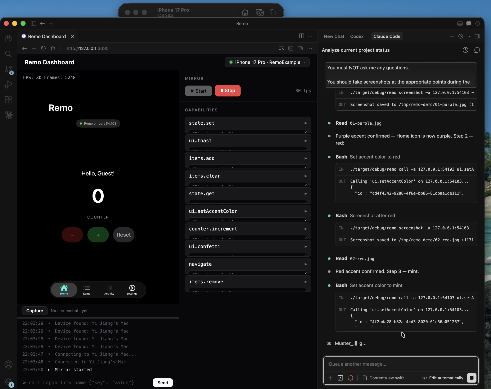

# Remo

**Infrastructure for agentic iOS development.**

[](https://github.com/yjmeqt/Remo/releases/download/v0.3.0-demo/remo_demo.mov)

AI agents can already write Swift and trigger builds, but they're still blind on iOS. Remo gives them the **eyes** and **hands** they need to discover real devices (USB) and simulators, invoke app capabilities, then **verify the result visually** through screenshots, live mirroring, or recorded video.

The result is a closed loop: **write code → build → call capabilities → inspect the UI → decide if the change is correct → iterate.** No human watching the simulator.

## Demo

**[Interactive showcase →](https://yjmeqt.github.io/Remo/)** Watch Claude Code autonomously verify an iOS app through Remo.

Or watch the raw demo video: [remo_demo.mov](https://github.com/yjmeqt/Remo/releases/download/v0.3.0-demo/remo_demo.mov)

```
# Agent writes code, triggers a build, then verifies via Remo:

remo devices                                            # discover real devices (USB) & simulators
remo call -a <addr> counter.increment '{"amount":5}'    # invoke a capability
remo screenshot -a <addr> -o after.jpg                  # capture the result
remo mirror -a <addr> --save recording.mp4              # or record video for animation review
# → Agent compares before/after screenshots to confirm the UI is correct
```

## Why Remo?

- **Agent-first.** Every API is designed for programmatic access. Agents discover real devices (USB) and simulators, invoke capabilities, and verify results — enabling fully autonomous write → test → fix cycles for iOS.
- **Extensible capabilities.** Developers register named handlers in Swift. Agents discover and call them at runtime — read CoreData, toggle feature flags, navigate routes, inject test data. If you can write it in Swift, an agent can call it.
- **Visual verification.** Screenshots and captured video let agents **see what the user sees** after every action. Screenshots for static UI checks; video recording for reviewing animations and transitions.
- **Instant feedback.** Capability call → UI update → screenshot capture in milliseconds, over USB or localhost.
- **Debug-only by default.** The SDK compiles to no-ops in Release builds (`#if DEBUG`), so it never ships to production.

## Quick Start

### 1. Add the SDK to your iOS app

**Swift (SPM)**

Add the SPM dependency in Xcode:

```
https://github.com/yjmeqt/remo-spm.git
```

**Swift (CocoaPods)**

```ruby
pod 'Remo', :podspec => 'https://raw.githubusercontent.com/yjmeqt/remo-spm/main/Remo.podspec'
```

**Objective-C (CocoaPods)**

```ruby
pod 'Remo/ObjC', :podspec => 'https://raw.githubusercontent.com/yjmeqt/remo-spm/main/Remo.podspec'
```

### 2. Register capabilities

**Swift**

```swift
import RemoSwift

// The server starts automatically on first API access.
// Simulator: random port (avoids collisions). Device: port 9930 (for USB tunnel).
Remo.register("myFeature.toggle") { params in
    let enabled = params["enabled"] as? Bool ?? false
    FeatureFlags.shared.myFeature = enabled
    return ["toggled": enabled]
}

// Unregister when no longer needed (e.g., in .onDisappear):
Remo.unregister("myFeature.toggle")
```

**Objective-C**

```objc
#import <RemoObjC/RMRemo.h>

// The server starts automatically on first API access.
[RMRemo registerCapability:@"myFeature.toggle"
                   handler:^NSDictionary *(NSDictionary *params) {
    BOOL enabled = [params[@"enabled"] boolValue];
    [FeatureFlags shared].myFeature = enabled;
    return @{@"toggled": @(enabled)};
}];

// Unregister when no longer needed:
[RMRemo unregisterCapability:@"myFeature.toggle"];
```

Capabilities can be unregistered dynamically — useful for page-level or conditional capabilities:

**Swift**

```swift
// Register when entering a screen
Remo.register("detail.getInfo") { _ in ["item": itemName] }

// Unregister when leaving
Remo.unregister("detail.getInfo")
```

**Objective-C**

```objc
// Register
[RMRemo registerCapability:@"detail.getInfo" handler:^NSDictionary *(NSDictionary *params) {
    return @{@"item": self.itemName};
}];

// Unregister
[RMRemo unregisterCapability:@"detail.getInfo"];
```

### 3. Install the CLI

```bash
# Homebrew (recommended)
brew install yjmeqt/tap/remo

# One-command install
curl -fsSL https://github.com/yjmeqt/Remo/releases/latest/download/install-remo.sh | bash

# Or from source
cargo install --git https://github.com/yjmeqt/Remo.git remo-cli
```

To uninstall:

```bash
# Homebrew install
brew uninstall remo

# Script-managed install (download, inspect, then run)
curl -fsSL https://github.com/yjmeqt/Remo/releases/latest/download/uninstall-remo.sh -o uninstall-remo.sh
bash uninstall-remo.sh
```

Manual release downloads are also available on the GitHub Releases page if you prefer to place `remo` on your `PATH` yourself.

### 4. Discover and interact

```bash
remo devices                                            # discover real devices & simulators
remo call -a <addr> myFeature.toggle '{"enabled":true}' # invoke your capability
remo screenshot -a <addr> -o screen.jpg                 # verify the result
remo mirror -a <addr> --web                             # inspect animations in the browser
# or:
remo dashboard                                          # open the multi-device web dashboard
```

## How It Works

```
┌──────────────────────────────────────┐
│  macOS                               │
│  remo CLI / AI agent                 │
│  ├── USB discovery (usbmuxd)        │
│  ├── Simulator discovery (Bonjour)   │
│  └── RPC client                      │
└──────────┬───────────────────────────┘
           │ TCP (USB tunnel / localhost)
┌──────────▼───────────────────────────┐
│  iOS                                 │
│  remo-sdk (Rust static lib)          │
│  ├── TCP server (tokio)              │
│  ├── Capability registry             │
│  ├── Bonjour advertisement           │
│  ├── Built-in: view tree, screenshot │
│  └── ObjC bridge (objc2)             │
│  ── FFI boundary ──                  │
│  RemoSwift (Swift wrapper)           │
│  Your app registers capabilities     │
└──────────────────────────────────────┘
```

The iOS SDK starts a TCP server inside your app. Real devices are discovered via USB (usbmuxd), simulators via Bonjour/mDNS. The macOS CLI (or any AI agent) sends JSON-RPC requests to invoke capabilities.

## CLI Commands

```bash
remo devices                              # Auto-discover devices (USB + Bonjour)
remo call -a <addr> <capability> [params] # Invoke a capability
remo list -a <addr>                       # List registered capabilities
remo screenshot -a <addr> -o out.jpg      # Take a screenshot
remo tree -a <addr>                       # Dump view hierarchy
remo info -a <addr>                       # Show device & app info
remo mirror -a <addr> --web               # Live screen mirror (H.264 → fMP4)
remo mirror -a <addr> --save out.mp4      # Record screen to file
remo watch -a <addr>                      # Stream events from device
remo dashboard                            # Web demo page
remo start [-d]                           # Start the daemon (foreground or background)
remo stop                                 # Stop the daemon
remo status                               # Check daemon health and device count
```

For a full command guide, see:

- [`skills/remo-setup/references/cli.md`](skills/remo-setup/references/cli.md) for the distributed onboarding CLI reference
- [`docs/cli.md`](docs/cli.md) for the repository maintenance checklist that keeps CLI docs aligned

## Built-in Capabilities

These are registered automatically by the SDK — no setup required:

| Capability | Description |
|------------|-------------|
| `__ping` | Connectivity check |
| `__list_capabilities` | List all registered capabilities |
| `__view_tree` | Snapshot the UIView hierarchy as JSON |
| `__screenshot` | Capture the screen (JPEG/PNG, configurable quality) |
| `__device_info` | Device model, OS version, screen dimensions |
| `__app_info` | Bundle ID, version, build number, display name |
| `__start_mirror` | Start H.264 screen mirror stream |
| `__stop_mirror` | Stop mirror stream |

## Claude Code Skills

Remo ships a set of [Claude Code skills](https://docs.anthropic.com/en/docs/claude-code/skills) that give AI agents structured workflows for iOS development. Install them into any iOS project to get a closed-loop: setup → capabilities → verified development → design review.

| Skill | Type | Purpose |
|-------|------|---------|
| [`remo-setup`](skills/remo-setup/SKILL.md) | One-time | Install CLI, integrate SDK, verify connection |
| [`remo-capabilities`](skills/remo-capabilities/SKILL.md) | Periodic | Map app features → register capabilities → document |
| [`remo`](skills/remo/SKILL.md) | Ongoing | Verified development with screenshot evidence and timeline reports |
| [`remo-design-review`](skills/remo-design-review/SKILL.md) | Periodic | Compare running app against Figma designs |

### Install skills into your iOS project

```bash
mkdir -p .claude/skills
cp -R /path/to/Remo/skills/remo-setup .claude/skills/
cp -R /path/to/Remo/skills/remo-capabilities .claude/skills/
cp -R /path/to/Remo/skills/remo .claude/skills/
cp -R /path/to/Remo/skills/remo-design-review .claude/skills/
```

See [`skills/README.md`](skills/README.md) for the skill overview. Each distributed skill folder carries its own `references/cli.md`; start with [`skills/remo-setup/references/cli.md`](skills/remo-setup/references/cli.md) for the broadest CLI guide.

---

## Development

Everything below is for contributing to Remo itself.

### Prerequisites

| Tool | Version | Notes |
|------|---------|-------|
| Rust | 1.82+ | Auto-installed via `rust-toolchain.toml` |
| Xcode | 16+ | iOS SDK + Swift 6.1 |

### Build from source

```bash
git clone https://github.com/yjmeqt/Remo.git && cd Remo
make setup   # Configure git hooks

cargo build -p remo-cli              # Build the CLI
./build-ios.sh sim                   # Build XCFramework (simulator)
./build-ios.sh device                # Build XCFramework (real device)
./build-ios.sh release               # Build all targets, optimized
```

### Crates

| Crate | Description |
|-------|-------------|
| `remo-protocol` | Message types + length-prefixed JSON framing codec |
| `remo-transport` | Bidirectional connection over TCP or Unix socket |
| `remo-usbmuxd` | macOS usbmuxd client — device discovery + USB tunneling |
| `remo-bonjour` | Bonjour/mDNS service registration and discovery |
| `remo-sdk` | iOS embedded server + capability registry + C FFI |
| `remo-objc` | ObjC runtime bridge via `objc2` (view tree, screenshot, device info) |
| `remo-desktop` | macOS library — device manager, RPC client, web dashboard, fMP4 muxer |
| `remo-daemon` | Background daemon — connection pool, HTTP/WebSocket API, event bus |
| `remo-cli` | CLI entry point |

### Project Status

**v0.3.0** — See [SPEC.md](SPEC.md) for the full architecture.

#### Roadmap
- [x] Auto-reconnection on disconnect (daemon ConnectionPool)
- [x] Capability change events + dynamic unregister API
- [ ] Skill installation and update (`remo init` / `remo skills update` to install/update `.claude/skills/` from release assets, with version pinning)
- [ ] macOS GUI (SwiftUI device inspector)
- [ ] View property modification (`__view_set`)
- [ ] Protocol versioning / handshake

## Contributing

See [CONTRIBUTING.md](CONTRIBUTING.md) for development setup and guidelines.

## License

[MIT](LICENSE)
